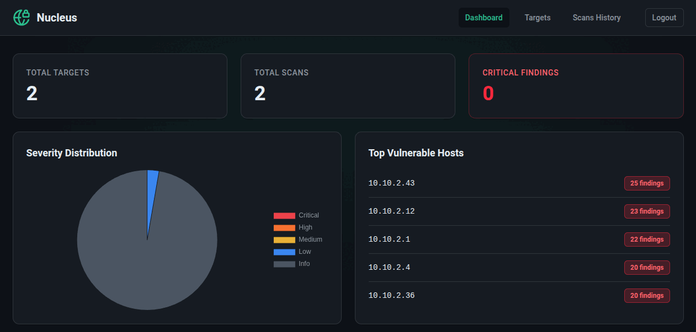

<div align="center">
  

# Nucleus - Vulnerability Scan Orchestrator

Nucleus is a single, self-contained Go binary that acts as an orchestration manager for scheduled [Nuclei](https://github.com/projectdiscovery/nuclei) vulnerability scans.

It serves an embedded Vue 3 SPA web dashboard, reads/writes scan states to a local SQLite database, and automatically dispatches HTML email reports and webhook notifications when scans complete.

</div>



## Prerequisites
- **Go 1.22+**
- **Node.js & npm** (for building the frontend)
- **Nuclei**: Ensure the `nuclei` CLI is installed and available in the system `$PATH`.

## Building the Application

Nucleus bundles the Vue 3 frontend directly into the Go binary using the `//go:embed` directive. 

### 1. Build the Frontend
```bash
cd frontend
npm install
npm run build
```
*(This places the static assets in the `dist/` directory).*

### 2. Compile the Go Binary
```bash
# From the root directory
go mod tidy
go build -o nucleus ./cmd/nucleus
```

## Download

The binary is availble for download from here:

https://apps.jdbnet.co.uk/nucleus

## Dashboard

By default, the web dashboard will be available on `http://<your-vm-ip>:8080`.

## Configuration

Most settings can be managed from the **Settings** page in the web dashboard. Values saved in the database take precedence; environment variables are used as fallbacks when a setting has not been configured in the UI.

### Settings page

| Setting | Description |
|---------|-------------|
| Instance URL | Base URL of your Nucleus deployment (e.g. `https://nucleus.example.com`). Used to include "View scan" links in notifications. |
| SMTP | Email server configuration for scan reports |
| Notification severity | Minimum severity threshold for sending notifications (default: **Always** - notify on every scan, including zero findings) |
| Retention days | How long to keep scan history |
| Web access | Optional dashboard username/password |
| Webhooks | Global webhook endpoints for scan notifications |

When dashboard authentication is enabled, clicking a scan link from a notification will redirect to login and then return you to the requested scan.

### Environment variable fallbacks

These environment variables can bootstrap configuration before using the Settings page, or override unset database values:

| Variable | Purpose |
|----------|---------|
| `NUCLEUS_URL` | Instance URL for notification links |
| `SMTP_HOST` | SMTP server hostname |
| `SMTP_PORT` | SMTP server port |
| `SMTP_FROM` | Email from address |
| `SMTP_TO` | Email recipient |
| `SMTP_USER` | SMTP username (optional) |
| `SMTP_PASS` | SMTP password (optional) |
| `RETENTION_DAYS` | Scan history retention (default: 30) |
| `WEB_USER` | Dashboard username (optional) |
| `WEB_PASS` | Dashboard password (optional) |

### Webhook providers

Nucleus supports multiple global webhooks. Supported provider formats:

- **Discord** - webhook URL
- **Slack** - incoming webhook URL
- **Gotify** - application message URL with token
- **Ntfy** - topic URL (e.g. `https://ntfy.sh/mytopic`)
- **Microsoft Teams** - legacy incoming webhook / connector URL
- **Generic** - plain-text POST to any compatible endpoint

Use the **Test** button on the Settings page to verify a webhook is working.

## Running as a Systemd Service

To keep Nucleus running continuously in the background on your VM, it is recommended to create a systemd service.

1. Create a service file:
```bash
sudo nano /etc/systemd/system/nucleus.service
```

2. Add the following configuration (adjust the `User`, `Group`, `WorkingDirectory`, and `ExecStart` paths to match your environment):

```ini
[Unit]
Description=Nucleus Vulnerability Scan Orchestrator
After=network.target

[Service]
Type=simple
WorkingDirectory=/opt/nucleus
ExecStart=/opt/nucleus/nucleus

# Optional: Instance URL for notification scan links
# Environment="NUCLEUS_URL=https://nucleus.example.com"

# SMTP Configuration (can also be configured via Settings page)
Environment="SMTP_HOST=localhost"
Environment="SMTP_PORT=25"
Environment="SMTP_FROM=nucleus@example.com"
Environment="SMTP_TO=admin@example.com"

# Optional: Add authentication if your SMTP server requires it
# Environment="SMTP_USER=username"
# Environment="SMTP_PASS=password"

# Optional: Add basic authentication to protect the web dashboard
# Environment="WEB_USER=admin"
# Environment="WEB_PASS=supersecret"

# Optional: Number of days to retain scan history in the database (Default: 30)
# Environment="RETENTION_DAYS=30"

Restart=always
RestartSec=5

[Install]
WantedBy=multi-user.target
```

3. Enable and start the service:
```bash
sudo systemctl daemon-reload
sudo systemctl enable nucleus
sudo systemctl start nucleus
sudo systemctl status nucleus
```

Note: Settings configured in the dashboard are stored in `app.db` and take precedence over environment variables.
